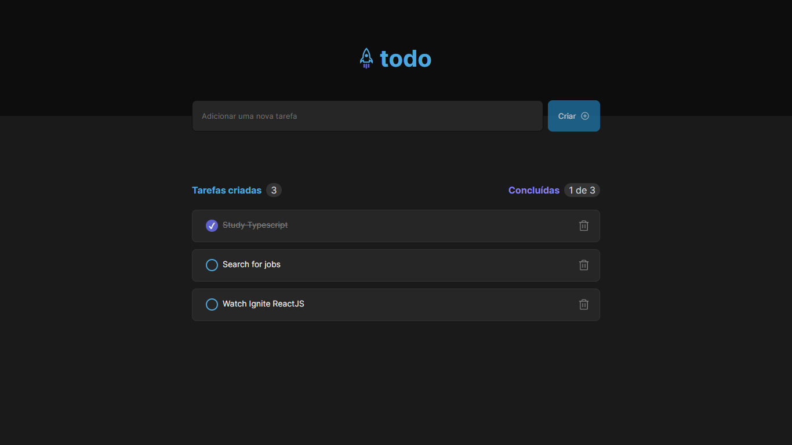
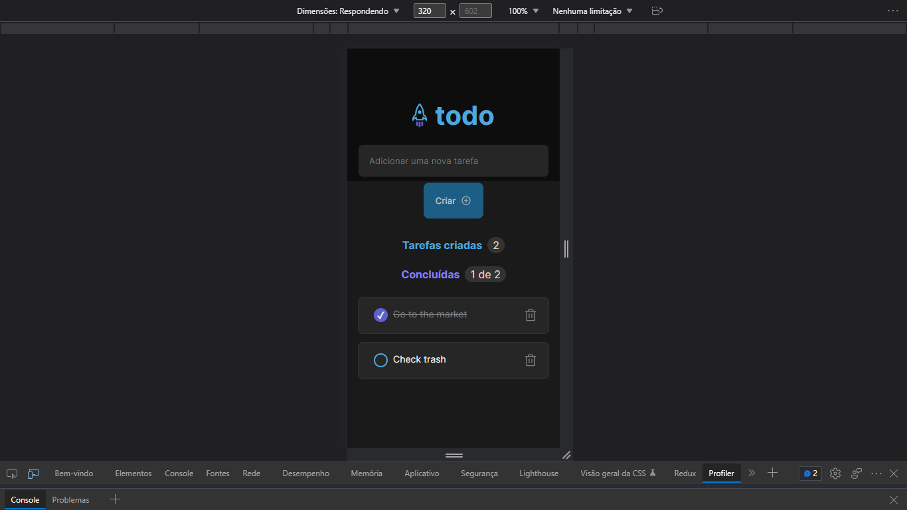

## Challenge 01 - Ignite 2022 - React JS

This challenge consist in practice the important concepts of React. Use State and hooks (in this project just used the UseState and UseEffect). Also work with vanilla JavaScript, using array functions like filter, map and reduce.

The application is a **todo List** that have the following functionalities:
* Add a new task
* Mark the task as done or undone
* Remove a task from the list
* show a progress of task completion

# Languages used

* HTML
* CSS
* JavaScript
* Typescript

# Explanation

Despite having few features, I have to pay attetion of concepts like:

* State managment
* state immutability
* Use the right hook to change the state (useState or useEffect)
* Componentization and Propeties
* Types

The code is well divided and easy to understand. Have a few components and code is well written.
Also, the application is responsive. It Works well in the mobile version.

# How can I use it?

First, check if you have the node and npm (comes with node) installed in your machine. To check, you must go to your terminal or command prompt and type:
> node -v
> npm -v

If shows the version, you are good to go. If not, go to https://nodejs.org/en/ and install the LTS version (it will install both node and npm).

Second, if you don't have an IDE, install one of you preference. In my case, I used Visual Studio Code.

Third, you clone the project. Use the commande line on your folder:
 > git clone https://github.com/Vinicius-PR/Challenge-01-Ignite-2022-To-do-List.git
 
 Fourth, open the folder using your IDE. Then, go to the terminal of your IDE and type the following command to install the dependencies: (or can go to the folder application using normal terminal and type the same command)
 > npm install
 
 Finally, type the next command to see the result and click on the link that will appear on the terminal:
 > npm run dev
 
 # ScreenShots

 ## Desktop Version

 

 ## Mobile Version

 
